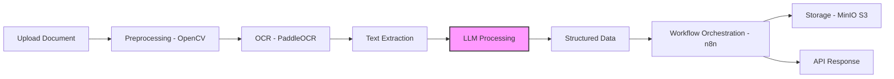
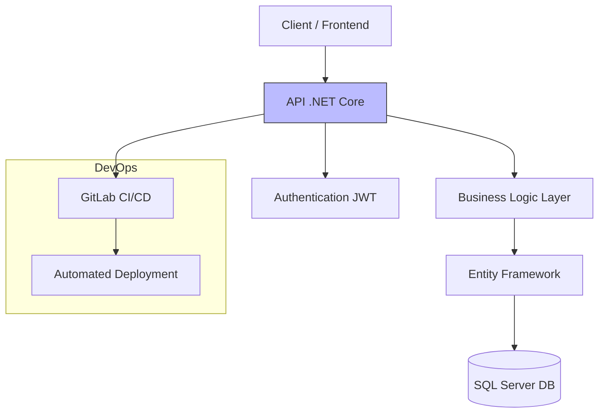
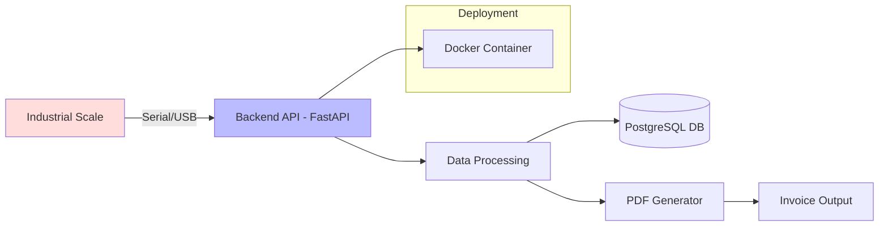
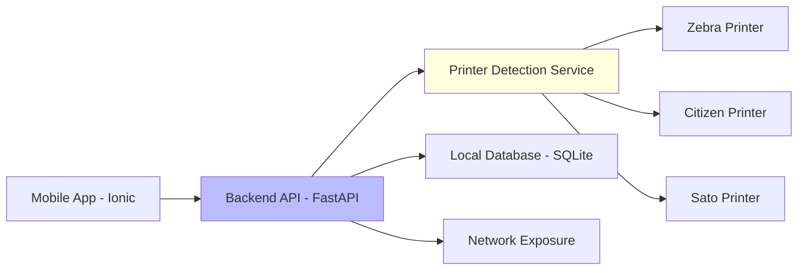

# 👋 Hi, I'm Joseph López

Backend Software Engineer specialized in scalable systems, AI-driven solutions, and process automation.

I have experience designing microservices architectures using Python (FastAPI) and .NET, integrating LLMs, OCR pipelines, and real-time industrial systems.

💡 I focus on building high-impact solutions that improve efficiency, reduce manual work, and scale with business needs.

---

## 🚀 Core Skills

- Backend Development: Python, FastAPI, .NET Core, C#
- AI & Automation: LangChain, LangGraph, LLMs, OCR (PaddleOCR, OpenCV)
- Cloud & DevOps: AWS (EC2, S3, RDS), Docker, CI/CD
- Databases: PostgreSQL, MSSQL Server, MySQL, MongoDB
- Architecture: Microservices, API Design, Concurrent Systems

## 🤖 Automated AI Audit Pipeline for Document Processing

### 📌 Problem
Manual validation and processing of business documents caused delays and human errors.

### ⚙️ Solution
Designed a microservices-based pipeline using OCR and LLMs to automate document analysis.

- Image preprocessing using OpenCV
- OCR extraction with PaddleOCR
- Data processing using Python & Pandas
- Workflow orchestration with n8n
- Secure document storage using MinIO (S3-like)

### 📈 Results
- Significant reduction in manual processing
- Faster document validation workflows
- Scalable architecture for future automation

### 🧠 Key Value
This system combines AI + automation + backend architecture to solve real enterprise problems.

## 🏗️ Warehouse Management System (WMS)

### 📌 Problem
Need for a scalable and reliable backend system to manage warehouse operations and inventory traceability.

### ⚙️ Solution
Developed a robust backend using .NET Core with enterprise-level practices.

- RESTful API design
- JWT Authentication & Authorization
- MSSQL Server optimization
- CI/CD pipelines with GitLab
- Unit testing with NUnit and code quality via SonarQube

### 📈 Results
- Stable and scalable system in production
- Improved inventory tracking and reliability
- Automated deployment pipelines

### 🧠 Key Value
Enterprise-grade backend architecture with strong focus on scalability and maintainability.

## 📡 Industrial Weighing & Invoicing Automation API

### 📌 Problem
Manual recording of industrial weighing data caused inefficiencies and errors.

### ⚙️ Solution
Developed a backend system that integrates directly with industrial hardware.

- Serial/USB communication with weighing scales
- Real-time data processing
- PostgreSQL data storage
- PDF invoice generation
- Dockerized deployment

### 📈 Results
- Automated data capture
- Reduced human error
- Reliable and persistent system for industrial use

### 🧠 Key Value
Rare combination of backend + hardware integration + automation.

## 🤖 AI Workflow Automation Agent

### 📌 Problem
Businesses needed to automate repetitive decision-making processes.

### ⚙️ Solution
Built intelligent agents using LangGraph and LLMs.

- Multi-step workflow orchestration
- Integration with external APIs
- Data extraction and classification using LLMs
- REST API exposure for integration

### 📈 Results
- Automated business processes
- Reduced manual workload
- Flexible system adaptable to multiple use cases

### 🧠 Key Value
Advanced AI orchestration using modern LLM frameworks.

## 🖨️ Multi-Brand Industrial Printing Gateway

### 📌 Problem
Managing multiple industrial printers across brands was complex and fragmented.

### ⚙️ Solution
Developed a centralized API for printer management.

- USB & Serial communication
- Support for Zebra, Citizen, Sato (ZPL)
- Mobile app integration (Ionic React)
- Local network exposure of devices

### 📈 Results
- Unified control of multiple devices
- Simplified operations
- Real-time monitoring

### 🧠 Key Value
IoT + backend + mobile integration.

## 💼 Services

I help businesses build scalable backend systems and automation solutions.

### 🔹 Backend Development
- REST APIs with Python or .NET
- Scalable microservices architecture

### 🔹 AI Integration
- LLM-based automation
- Document processing (OCR + AI)

### 🔹 Process Automation
- Workflow automation using AI agents
- Business system integrations

### 🔹 System Optimization
- Performance improvements
- Refactoring legacy systems

## 📬 Contact

- Email: joseph_desarrolloit@hotmail.com
- Phone: +52 481 3843666
- LinkedIn: https://www.linkedin.com/in/joseph-aldahir-l%C3%B3pez-hern%C3%A1ndez-2a933324b
